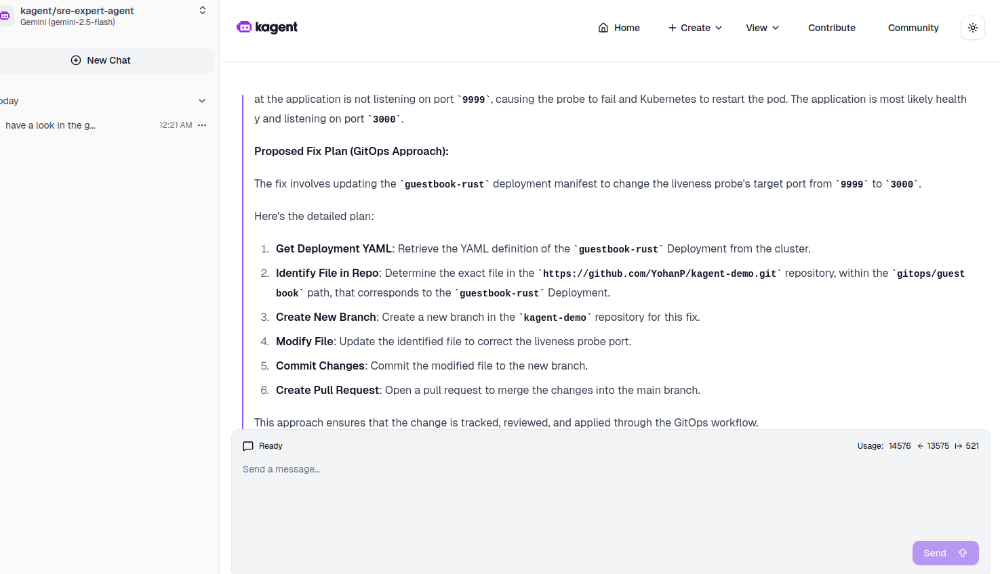
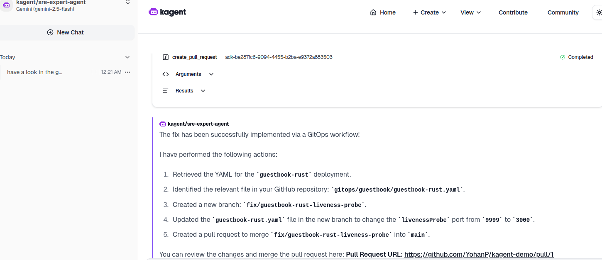
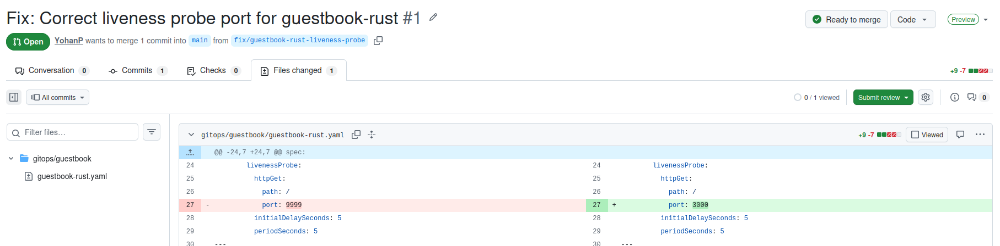

# kagent AI-Driven GitOps Demo

This repository demonstrates a modern **Self-Healing Infrastructure** workflow using the [kagent](https://kagent.dev) AI agent. It showcases how an AI agent can bridge the gap between runtime failures in a Kubernetes cluster and the GitOps source of truth.

The demo environment simulates the daily operations of a Platform Engineer or SRE, emphasizing automated problem detection and remediation via Pull Requests.

---

## Project Architecture

The setup involves a complete local GitOps stack:

- **Local Cluster**: Managed by `k3d`.
- **GitOps Engine**: `ArgoCD` managing the application lifecycle.
- **Application**: A [Guestbook App](https://github.com/YohanP/guestbook-rust) written in **Rust**.
- **AI Agent**: `kagent` powered by **Google Gemini** but you could change it to use an other provider.

---

## Local Environment Setup

### Prerequisites

- Docker
- k3d
- kubectl

The local environment is designed to be "One-Click" reproducible. Simply execute the bootstrap script to provision the entire lab:

```bash
./scripts/setup.sh
```

After running the setup script, you need to add an entry to your `/etc/hosts` file to resolve `guestbook.local` to your local machine. This is necessary because of the Traefik Ingress configuration used in this setup.

Add the following line to your [`/etc/hosts`](/etc/hosts) file:

```bash
127.0.0.1 guestbook.local
```

Then you could browse the app here: http://guestbook.local:8080
and to browse ArgoCD UI: http://localhost:8080/

## kagent Setup

The previous steps established a traditional GitOps foundation. Now, we enter the **AI-Ops** territory by deploying `kagent`.

### 1. Installing the CLI

First, we need the `kagent` CLI to bootstrap the agent within our cluster. While Helm is an alternative, the CLI provides the most streamlined experience for this demonstration.

```bash
# Fetch and install the latest kagent binary
curl https://raw.githubusercontent.com/kagent-dev/kagent/refs/heads/main/scripts/get-kagent | bash
```

### 2. Provisioning the Agent in the Cluster

We will use the demo profile for a quick-start installation.

> [!NOTE]
> The OpenAI Quirk: Currently, the kagent install command expects an OPENAI_API_KEY by default. Since our architecture explicitly uses Google Gemini, we bypass this requirement with a placeholder value to proceed with the bootstrap.

```bash
export OPENAI_API_KEY="dontcare" && kagent install --profile demo
```

Accessing the kagent dashboard (UI)

```bash
kagent dashboard
kubectl port-forward -n kagent service/kagent-ui 8082:8080
```

You could browse kagent UI: http://localhost:8082

### 3. Empowering the Agent: "Brain & Hands"

To perform its duties, the agent needs two core capabilities: a reasoning engine (Gemini) and the ability to act on code (GitHub). Kubernetes capabilities are already setup by default.
We store these credentials securely as Kubernetes Secrets in the kagent namespace.

```bash
kubectl create secret generic kagent-gemini \
 -n kagent \
 --from-literal GOOGLE_API_KEY=YOUR_GOOGLE_API_KEY

kubectl create secret generic github-pat \
 -n kagent \
 --from-literal GITHUB_PERSONAL_ACCESS_TOKEN=YOUR_PAT
```

### 4. Defining the SRE Persona

Instead of a generic assistant, we configure a Specialized SRE Agent. This is achieved by applying three specific layers of configuration:

- ModelConfig, see [`kagent/kagent-gemini-config.yaml`](kagent/kagent-gemini-config.yaml): Directs the agent to use Gemini as the primary inference engine.
- MCP Server, see [`kagent/kagent-github-mcp.yaml`](kagent/kagent-github-mcp.yaml): Enables the Model Context Protocol (MCP) for GitHub, granting the agent the "tools" to read/write in the repository.
- Agent Definition, see [`kagent/kagent-devops-expert.yaml`](kagent/kagent-devops-expert.yaml): The final "persona" that combines the model, the tools, and the SRE troubleshooting logic.

```bash
# Apply the Gemini configuration and GitHub connectivity (MCP)
kubectl -n kagent apply -f kagent/kagent-gemini-config.yaml
kubectl -n kagent apply -f kagent/kagent-github-mcp.yaml

# Deploy the final "DevOps Expert" agent definition
kubectl -n kagent apply -f kagent/kagent-sre-expert.yaml
```

Our SRE agent is now ready and we will use it in the next part.

## Demo Scenario

This scenario demonstrates a complete SRE recovery loop: from detecting a silent failure to automated remediation via a GitOps Pull Request.

---

### 1. Initial State -> It is alright
* **Action**: Check the ArgoCD UI. Everything is **Healthy** and **Synced**.
* **Context**: The Rust Guestbook application is running. Users can access it, and Kubernetes reports no issues.

---

### 2. The Incident: Introducing a Configuration Drift
* **Action**: Manually edit the `gitops/guestbook/guestbook-rust.yaml` to update the **Liveness Probe** on the wrong port (**9999** instead of **3000**). Commit and Push this change.
* **Observation**: ArgoCD detects the change and syncs. The Pods start failing their health checks and enter a `CrashLoopBackOff`. The ArgoCD status turns **Red (Degraded)**.

---

### 3. The Resolution: Enter in the kagent sre-expert-agent
* **Action**: Browse to http://localhost:8082/agents/kagent/sre-expert-agent/chat 
and enter the following prompt:

```bash
have a look in the guestbook-rust pod and related event, it seems there is an issue. Can you identify the root cause and propose a fix plan ?
```

* **Narration**: *"Instead of a manual fix, we use kagent. Powered by Gemini, it correlates live cluster events with our GitHub source code."*
* **Expected AI Reasoning/Steps**: 
    1. Identifies the `LivenessProbe` error in the cluster events.
    2. Searches the Git repository for the corresponding Deployment file.
    3. Detects the mismatch between `containerPort: 3000` and `port: 9999`.
    4. Proposes a remediation action plan.
    5. If the remediation plan fits well, you can accept it by prompting.
    6. Creates the PR with the fix.


*Capture of remediation plan created by kagent.*


*Capture of kagent actions done when the remediation plan was accepted.*

---

### 4. The GitOps Fix: Automated Pull Request
* **Action**: Navigate to the "Pull Requests" tab of your GitHub repository.
* **Narration**: *"kagent follows strict GitOps principles. It does not patch the cluster directly; instead, it proposes a fix in the Git repository via a PR."*


*Capture of Pull Request created by kagent.*

---

### 5. Closing the Loop: Recovery
* **Action**: Merge the Pull Request on GitHub.
* **Observation**: ArgoCD automatically detects the merge, syncs the corrected manifest, and the Pods return to a **Healthy** state.
* **Conclusion**: *"The incident is resolved with a perfect audit trail in Git, without the SRE ever having to manually edit a YAML file."*

## Final Thoughts and Cleanup

Feel free to enjoy and play with this lab/demo. Try differents scenarios by breaking others resources or test others agents (some preconfigured agents in `kagent`).

To clean the environment

```bash
./scripts/cleanup.sh
```
